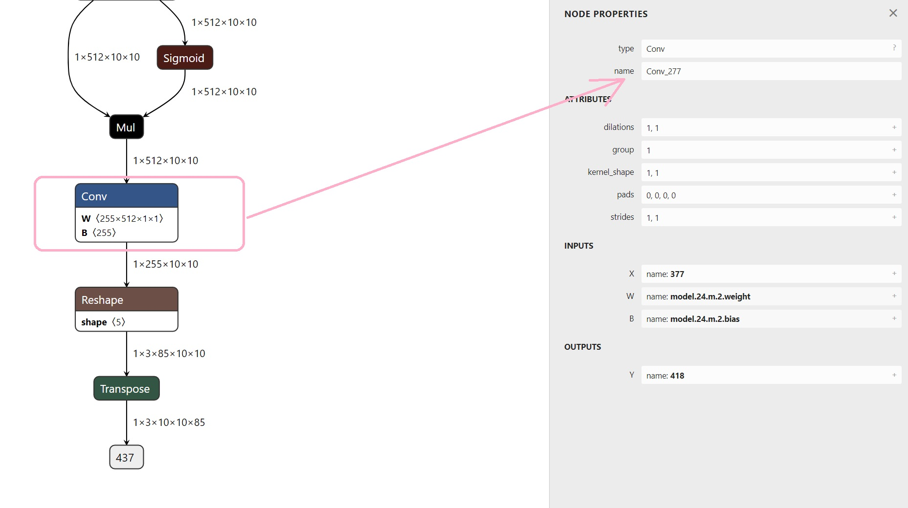
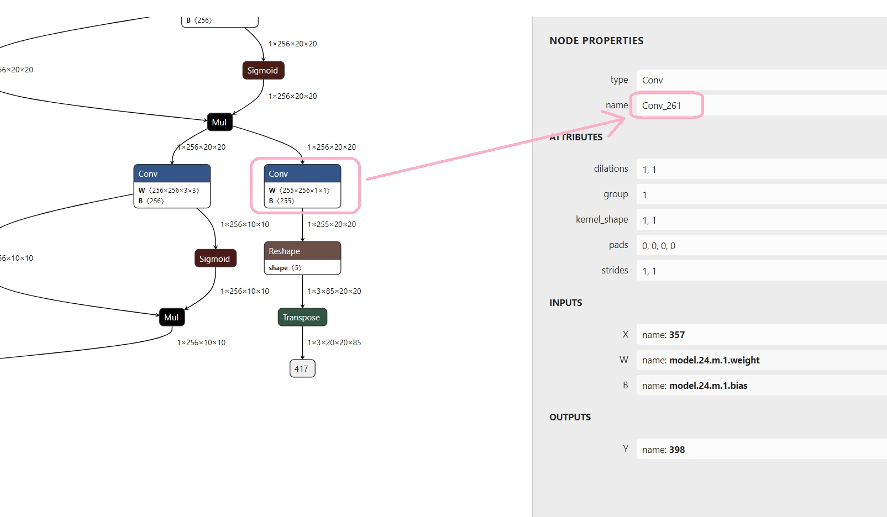
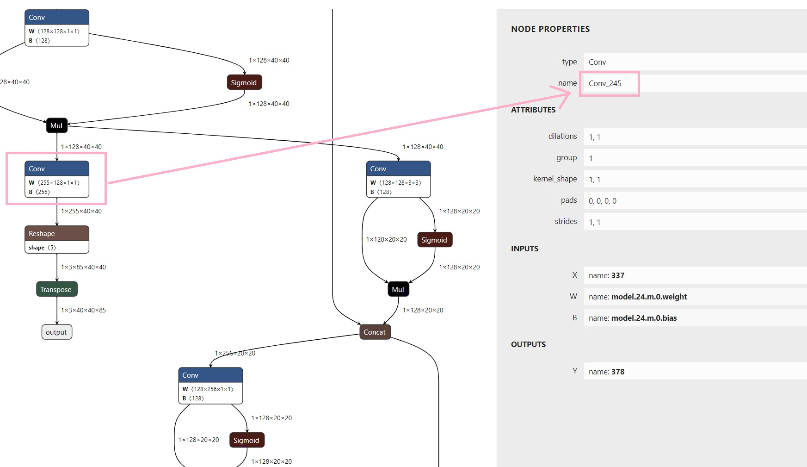

# yolov5s_android
### Environment
```sh
git clone https://github.com/moyans/yolov5s_android
cd yolov5s_android
git checkout moyan
```


### 1. 用自己的数据训练yolov5的检测模型，并且转换成onnx-slim格式

```bash
git clone https://github.com/ultralytics/yolov5
cd yolov5
pip install -r requirements.txt
pip install -U coremltools onnx scikit-learn==0.19.2  # export requirements

# export at 640x640 with batch size 1
python export.py --weights yolov5s.pt --img 640 --batch 1  
python -m onnxsim yolov5s.onnx yolov5s-sim.onnx
```

### 2. 下载转换环境

```bash
docker push moyans/openvino_ubuntu18_dev:latest
docker run -it -u 0 --rm  -v /d:/d moyans/openvino_ubuntu18_dev:latest bash
```

### 3. 将onnx转到openvino(docker环境下)

```bash
python3 /opt/intel/openvino_2021/deployment_tools/model_optimizer/mo.py --input_model yolov5s-sim.onnx --input_shape [1,3,640,640] --output_dir ./openvino --data_type FP32 --output Conv_245,Conv_261,Conv_277
# 注意输出的节点  Netron可视化
```





### 4. openvino 转 pb(docker环境下)

```bash
openvino2tensorflow --model_path ./openvino/yolov5s-sim.xml --model_output_path tflite --output_pb --output_saved_model --output_no_quant_float32_tflite
```

### 5. pb转tflite（docker环境）

```bash
python3 quantize.py
```


### 6. tflite测试